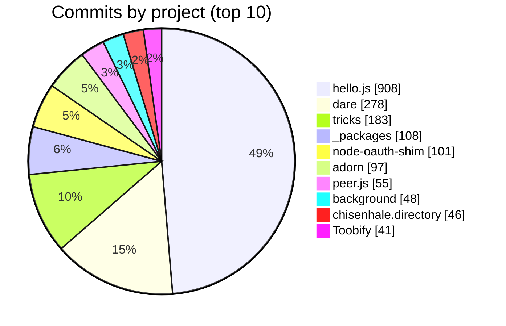

# Projects

Projects created or contributed to by [@MrSwitch](https://github.com/MrSwitch).

_Generated on 2026-10-10 — do not edit by hand, run `npm run projects`._

## Contribution history

All contributions by year — including private and organisation
repositories, aggregated anonymously (`█` public commits, `░` private).

| Year | Commits | Private | Graph |
| --- | ---: | ---: | :--- |
| 2026 | 93 | 1558 | `█▍░░░░░░░░░░░░░░░░░░░░░░░▋` |
| 2025 | 76 | 895 | `█▏░░░░░░░░░░░░░▌` |
| 2024 | 54 | 621 | `▉░░░░░░░░░▍` |
| 2023 | 60 | 555 | `▉░░░░░░░░▍` |
| 2022 | 95 | 654 | `█▌░░░░░░░░░▉` |
| 2021 | 104 | 991 | `█▋░░░░░░░░░░░░░░░` |
| 2020 | 108 | 1178 | `█▋░░░░░░░░░░░░░░░░░▉` |
| 2019 | 76 | 706 | `█▏░░░░░░░░░░▊` |
| 2018 | 63 | 650 | `█░░░░░░░░░▉` |
| 2017 | 50 | 454 | `▊░░░░░░▉` |
| 2016 | 179 | 377 | `██▊░░░░░▊` |
| 2015 | 761 | 114 | `███████████▌░▊` |
| 2014 | 740 | 62 | `███████████▎░` |
| 2013 | 531 | 117 | `████████░▊` |
| 2012 | 398 | 6 | `██████▏` |
| 2011 | 123 | 132 | `█▉░░` |

**All time:** 3511 public commits · 9070 private contributions · 580 pull requests · 135 issues · 66 reviews

---

## [tricks](https://github.com/MrSwitch/tricks)

Tricks and tips in ES

**Active:** Sept 2015 – Oct 2026

**Links:** [Repository](https://github.com/MrSwitch/tricks) · [Website](https://adodson.com/tricks/) · [Issues](https://github.com/MrSwitch/tricks/issues)

**Languages:**

`██████████████████████████████░`

`JavaScript` 99.1% · `HTML` 0.9%

**My contributions:**

| Metric | Count | Graph |
| --- | ---: | :--- |
| Commits | 183 | `████` |
| Pull requests | 43 | `███▊` |
| Issues created | 0 | `` |
| Issues completed | 0 | `` |

---

## [blockfighter](https://github.com/MrSwitch/blockfighter)

Vibe coded by a 10 year old 😃

**Active:** Oct 2026 – Oct 2026

**Links:** [Repository](https://github.com/MrSwitch/blockfighter) · [Issues](https://github.com/MrSwitch/blockfighter/issues)

**Languages:**

`█████████████████████████████░█`

`TypeScript` 97.1% · `HTML` 2.2% · `CSS` 0.7%

**My contributions:**

| Metric | Count | Graph |
| --- | ---: | :--- |
| Commits | 9 | `▎` |
| Pull requests | 0 | `` |
| Issues created | 0 | `` |
| Issues completed | 0 | `` |

---

## [chisenhale.directory](https://github.com/MrSwitch/chisenhale.directory)

Chisenhale Primary School's PTA Directory website, aka "Little Black Book". Promoting community businesses, of interest to parents and teachers, in recognition for their sponsorship towards the schools PTA fund.

**Active:** Apr 2025 – Oct 2026

**Links:** [Repository](https://github.com/MrSwitch/chisenhale.directory) · [Website](http://chisenhale.directory/) · [Issues](https://github.com/MrSwitch/chisenhale.directory/issues)

**Tags:** `#charity-website`

**Languages:**

`█████████████░░░░░░░░░███████`

`CSS` 44.1% · `JavaScript` 31.3% · `HTML` 24.7%

**My contributions:**

| Metric | Count | Graph |
| --- | ---: | :--- |
| Commits | 46 | `█` |
| Pull requests | 45 | `████` |
| Issues created | 1 | `▏` |
| Issues completed | 0 | `` |

---

## [dare](https://github.com/MrSwitch/dare)

Database and REST

**Active:** May 2016 – Sept 2026

**Links:** [Repository](https://github.com/MrSwitch/dare) · [Website](https://adodson.com/dare) · [Issues](https://github.com/MrSwitch/dare/issues)

**Tags:** `#sql` `#sql-condition` `#database` `#schema`

**Languages:**

`██████████████████████████████░█`

`TypeScript` 98.4% · `Shell` 1.6% · `HTML` 0.0%

**My contributions:**

| Metric | Count | Graph |
| --- | ---: | :--- |
| Commits | 278 | `██████▏` |
| Pull requests | 226 | `████████████████████` |
| Issues created | 71 | `██████▎` |
| Issues completed | 60 | `█████▎` |

---

## [optimus-primes](https://github.com/MrSwitch/optimus-primes)

computation paradigms supported by the browser

**Active:** Sept 2026 – Sept 2026

**Links:** [Repository](https://github.com/MrSwitch/optimus-primes) · [Website](https://adodson.com/optimus-primes) · [Issues](https://github.com/MrSwitch/optimus-primes/issues)

**Languages:**

`████████████░░░░░░░████░░░░██`

`JavaScript` 41.3% · `HTML` 24.9% · `Rust` 14.6% · `C` 13.6% · `Shell` 5.5%

**My contributions:**

| Metric | Count | Graph |
| --- | ---: | :--- |
| Commits | 2 | `` |
| Pull requests | 0 | `` |
| Issues created | 0 | `` |
| Issues completed | 0 | `` |

---

## [hello.js](https://github.com/MrSwitch/hello.js)

A Javascript RESTFUL API library for connecting with OAuth2 services, such as Google+ API, Facebook Graph and Windows Live Connect

**Active:** Aug 2011 – Jan 2026

**Links:** [Repository](https://github.com/MrSwitch/hello.js) · [Website](https://adodson.com/hello.js/) · [Issues](https://github.com/MrSwitch/hello.js/issues)

**Languages:**

`███████████████████████████░░█░█░`

`JavaScript` 89.5% · `CSS` 8.1% · `HTML` 1.5% · `Less` 0.7% · `Shell` 0.2% · `Makefile` 0.0%

**My contributions:**

| Metric | Count | Graph |
| --- | ---: | :--- |
| Commits | 908 | `████████████████████` |
| Pull requests | 32 | `██▉` |
| Issues created | 8 | `▊` |
| Issues completed | 5 | `▌` |

---

## [adorn](https://github.com/MrSwitch/adorn)

Drop a `<link type=stylesheet href="adorn.css"/>` and a `<script src="adorn.js"/>` onto a an HTML page generated from markdown and watch it sparkle ✨

**Active:** Sept 2014 – Jun 2025

**Links:** [Repository](https://github.com/MrSwitch/adorn) · [Website](https://adodson.com/adorn/) · [Issues](https://github.com/MrSwitch/adorn/issues)

**Languages:**

`█████████████████░░░░░░░░░░░░█░`

`JavaScript` 58.3% · `Less` 41.0% · `HTML` 0.5% · `Ruby` 0.2%

**My contributions:**

| Metric | Count | Graph |
| --- | ---: | :--- |
| Commits | 97 | `██▏` |
| Pull requests | 7 | `▋` |
| Issues created | 2 | `▏` |
| Issues completed | 0 | `` |

---

## [background](https://github.com/MrSwitch/background)

Canvas based background animations

**Active:** Aug 2015 – Oct 2024

**Links:** [Repository](https://github.com/MrSwitch/background) · [Website](https://adodson.com/background) · [Issues](https://github.com/MrSwitch/background/issues)

**Languages:**

`██████████████████████████████`

`JavaScript` 100.0%

**My contributions:**

| Metric | Count | Graph |
| --- | ---: | :--- |
| Commits | 48 | `█` |
| Pull requests | 2 | `▏` |
| Issues created | 0 | `` |
| Issues completed | 0 | `` |

---

## [localhost](https://github.com/MrSwitch/localhost)

Node static file server

**Active:** Sept 2015 – Sept 2024

**Links:** [Repository](https://github.com/MrSwitch/localhost) · [Website](https://adodson.com/localhost/) · [Issues](https://github.com/MrSwitch/localhost/issues)

**Languages:**

`██████████████████████████████`

`JavaScript` 100.0%

**My contributions:**

| Metric | Count | Graph |
| --- | ---: | :--- |
| Commits | 20 | `▌` |
| Pull requests | 7 | `▋` |
| Issues created | 0 | `` |
| Issues completed | 0 | `` |

---

## [node-oauth-shim](https://github.com/MrSwitch/node-oauth-shim)

Node OAuth Shim is a RESTful way to authenticate and sign request with OAuth1/1a endpoints 

**Active:** Jul 2013 – Jun 2020

**Links:** [Repository](https://github.com/MrSwitch/node-oauth-shim) · [Website](https://npmjs.org/package/oauth-shim) · [Issues](https://github.com/MrSwitch/node-oauth-shim/issues)

**Languages:**

`██████████████████████████████`

`JavaScript` 100.0%

**My contributions:**

| Metric | Count | Graph |
| --- | ---: | :--- |
| Commits | 101 | `██▎` |
| Pull requests | 5 | `▌` |
| Issues created | 3 | `▎` |
| Issues completed | 1 | `▏` |

---

## [Toobify](https://github.com/MrSwitch/Toobify)

Toobify website, youtube player

**Active:** Jul 2011 – Oct 2016

**Links:** [Repository](https://github.com/MrSwitch/Toobify) · [Website](http://toobify.com) · [Issues](https://github.com/MrSwitch/Toobify/issues)

**Languages:**

`██████████████░░░░░░░░███████░`

`JavaScript` 46.3% · `HTML` 26.4% · `CSS` 22.4% · `PHP` 4.9%

**My contributions:**

| Metric | Count | Graph |
| --- | ---: | :--- |
| Commits | 41 | `▉` |
| Pull requests | 0 | `` |
| Issues created | 0 | `` |
| Issues completed | 0 | `` |

---

## [node-shunt](https://github.com/MrSwitch/node-shunt)

A shit alternative to grunt for combining and minifying code for production

**Active:** Jul 2013 – Jul 2016

**Links:** [Repository](https://github.com/MrSwitch/node-shunt) · [Issues](https://github.com/MrSwitch/node-shunt/issues)

**Languages:**

`██████████████████████████████░█`

`JavaScript` 99.5% · `HTML` 0.4% · `CSS` 0.0%

**My contributions:**

| Metric | Count | Graph |
| --- | ---: | :--- |
| Commits | 32 | `▊` |
| Pull requests | 0 | `` |
| Issues created | 0 | `` |
| Issues completed | 0 | `` |

---

## [hellojs-chromeapp-demo](https://github.com/MrSwitch/hellojs-chromeapp-demo)

Implementation of HelloJS in a Chrome Application

**Active:** Jul 2015 – Jul 2016

**Links:** [Repository](https://github.com/MrSwitch/hellojs-chromeapp-demo) · [Issues](https://github.com/MrSwitch/hellojs-chromeapp-demo/issues)

**Languages:**

`████████████████░░░░░░░░░░░░░█`

`JavaScript` 54.6% · `HTML` 43.0% · `CSS` 2.4%

**My contributions:**

| Metric | Count | Graph |
| --- | ---: | :--- |
| Commits | 11 | `▎` |
| Pull requests | 0 | `` |
| Issues created | 0 | `` |
| Issues completed | 0 | `` |

---

## [base64-cli](https://github.com/MrSwitch/base64-cli)

**Active:** Jul 2016 – Jul 2016

**Links:** [Repository](https://github.com/MrSwitch/base64-cli) · [Issues](https://github.com/MrSwitch/base64-cli/issues)

**Languages:**

`██████████████████████████████`

`JavaScript` 100.0%

**My contributions:**

| Metric | Count | Graph |
| --- | ---: | :--- |
| Commits | 6 | `▏` |
| Pull requests | 0 | `` |
| Issues created | 0 | `` |
| Issues completed | 0 | `` |

---

## [pant-y-lon](https://github.com/MrSwitch/pant-y-lon)

**Active:** Jul 2016 – Jul 2016

**Links:** [Repository](https://github.com/MrSwitch/pant-y-lon) · [Issues](https://github.com/MrSwitch/pant-y-lon/issues)

**Languages:**

`██████████████░░░░░░░░░░██████`

`CSS` 45.3% · `HTML` 33.9% · `JavaScript` 20.9%

**My contributions:**

| Metric | Count | Graph |
| --- | ---: | :--- |
| Commits | 1 | `` |
| Pull requests | 0 | `` |
| Issues created | 0 | `` |
| Issues completed | 0 | `` |

---

## [brightcove-api](https://github.com/MrSwitch/brightcove-api)

A NodeJS API for signing and sending calls to the BrightCove CMS API

**Active:** Nov 2015 – Jul 2016

**Links:** [Repository](https://github.com/MrSwitch/brightcove-api) · [Issues](https://github.com/MrSwitch/brightcove-api/issues)

**Languages:**

`█████████████████░░░░░░░░░░░░░`

`CoffeeScript` 55.2% · `JavaScript` 44.8%

**My contributions:**

| Metric | Count | Graph |
| --- | ---: | :--- |
| Commits | 4 | `▏` |
| Pull requests | 0 | `` |
| Issues created | 0 | `` |
| Issues completed | 0 | `` |

---

## [peer.js](https://github.com/MrSwitch/peer.js)

A multipeer WebRTC client

**Active:** Jul 2012 – Jun 2016

**Links:** [Repository](https://github.com/MrSwitch/peer.js) · [Website](http://adodson.com/peer.js) · [Issues](https://github.com/MrSwitch/peer.js/issues)

**Languages:**

`█████████████████████░░░░░░░░░`

`JavaScript` 68.6% · `HTML` 31.4%

**My contributions:**

| Metric | Count | Graph |
| --- | ---: | :--- |
| Commits | 55 | `█▎` |
| Pull requests | 0 | `` |
| Issues created | 0 | `` |
| Issues completed | 0 | `` |

---

## [esi](https://github.com/MrSwitch/esi)

Edge Side Includes processing for Node environments

**Active:** Jul 2014 – Jun 2016

**Links:** [Repository](https://github.com/MrSwitch/esi) · [Website](https://www.npmjs.org/package/esi) · [Issues](https://github.com/MrSwitch/esi/issues)

**Languages:**

`██████████████████████████████`

`JavaScript` 100.0%

**My contributions:**

| Metric | Count | Graph |
| --- | ---: | :--- |
| Commits | 29 | `▋` |
| Pull requests | 0 | `` |
| Issues created | 0 | `` |
| Issues completed | 0 | `` |

---

## [notification.js](https://github.com/MrSwitch/notification.js)

A shim polyfill for adding notifications to browsers which offer limited support

**Active:** Aug 2011 – Jun 2016

**Links:** [Repository](https://github.com/MrSwitch/notification.js) · [Website](https://adodson.com/notification.js/) · [Issues](https://github.com/MrSwitch/notification.js/issues)

**Languages:**

`█████████████████░░░░░░░░░░░░░`

`JavaScript` 55.0% · `HTML` 45.0%

**My contributions:**

| Metric | Count | Graph |
| --- | ---: | :--- |
| Commits | 24 | `▌` |
| Pull requests | 0 | `` |
| Issues created | 0 | `` |
| Issues completed | 0 | `` |

---

## [hellojs-phonegap-demo](https://github.com/MrSwitch/hellojs-phonegap-demo)

Demo application of Hello.js running inside Phonegap

**Active:** Mar 2014 – Feb 2016

**Links:** [Repository](https://github.com/MrSwitch/hellojs-phonegap-demo) · [Issues](https://github.com/MrSwitch/hellojs-phonegap-demo/issues)

**Languages:**

`██████████████████████████████`

`HTML` 100.0%

**My contributions:**

| Metric | Count | Graph |
| --- | ---: | :--- |
| Commits | 22 | `▌` |
| Pull requests | 0 | `` |
| Issues created | 0 | `` |
| Issues completed | 0 | `` |

---

## [hellojs-signin-demo](https://github.com/MrSwitch/hellojs-signin-demo)

Demo of using HelloJS with a backend login and session management

**Active:** Nov 2015 – Jan 2016

**Links:** [Repository](https://github.com/MrSwitch/hellojs-signin-demo) · [Website](https://hellojs-signin-demo.herokuapp.com) · [Issues](https://github.com/MrSwitch/hellojs-signin-demo/issues)

**Languages:**

`██████████████████████████░░░░`

`JavaScript` 86.1% · `HTML` 13.9%

**My contributions:**

| Metric | Count | Graph |
| --- | ---: | :--- |
| Commits | 9 | `▎` |
| Pull requests | 0 | `` |
| Issues created | 0 | `` |
| Issues completed | 0 | `` |

---

## [css-in-the-shadow-dom](https://github.com/MrSwitch/css-in-the-shadow-dom)

CSS in the Shadow DOM

**Active:** Dec 2014 – Oct 2015

**Links:** [Repository](https://github.com/MrSwitch/css-in-the-shadow-dom) · [Website](http://adodson.com/css-in-the-shadow-dom/) · [Issues](https://github.com/MrSwitch/css-in-the-shadow-dom/issues)

**Languages:**

`██████████████░░░░░░░░░░██████`

`CSS` 46.4% · `HTML` 34.9% · `JavaScript` 18.8%

**My contributions:**

| Metric | Count | Graph |
| --- | ---: | :--- |
| Commits | 25 | `▌` |
| Pull requests | 1 | `▏` |
| Issues created | 0 | `` |
| Issues completed | 0 | `` |

---

## [dropfile](https://github.com/MrSwitch/dropfile)

Dropfile is a shim which uses Silverlight to recreate the part of the HTML5 FileAPI which lets us drag files into the IE browser and read em'

**Active:** Jul 2011 – Oct 2015

**Links:** [Repository](https://github.com/MrSwitch/dropfile) · [Website](http://adodson.com/dropfile/) · [Issues](https://github.com/MrSwitch/dropfile/issues)

**Languages:**

`██████████████████░░░░░░░█████`

`JavaScript` 60.5% · `HTML` 22.9% · `C#` 16.6%

**My contributions:**

| Metric | Count | Graph |
| --- | ---: | :--- |
| Commits | 35 | `▊` |
| Pull requests | 0 | `` |
| Issues created | 0 | `` |
| Issues completed | 0 | `` |

---

## [workspace.js](https://github.com/MrSwitch/workspace.js)

workspace.js a jquery plugin for making frameset's and moveable content

**Active:** May 2012 – Sept 2015

**Links:** [Repository](https://github.com/MrSwitch/workspace.js) · [Website](http://adodson.com/workspace.js/) · [Issues](https://github.com/MrSwitch/workspace.js/issues)

**Languages:**

`██████████████████░░░░░░░█████`

`JavaScript` 60.9% · `CSS` 23.8% · `HTML` 15.3%

**My contributions:**

| Metric | Count | Graph |
| --- | ---: | :--- |
| Commits | 41 | `▉` |
| Pull requests | 5 | `▌` |
| Issues created | 0 | `` |
| Issues completed | 0 | `` |

---

## [selfie](https://github.com/MrSwitch/selfie)

Strike a pose

**Active:** Sept 2015 – Sept 2015

**Links:** [Repository](https://github.com/MrSwitch/selfie) · [Website](https://adodson.com/selfie/) · [Issues](https://github.com/MrSwitch/selfie/issues)

**Languages:**

`████████████████████████████░░`

`JavaScript` 93.9% · `HTML` 6.1%

**My contributions:**

| Metric | Count | Graph |
| --- | ---: | :--- |
| Commits | 3 | `▏` |
| Pull requests | 0 | `` |
| Issues created | 0 | `` |
| Issues completed | 0 | `` |

---

## [keyboard](https://github.com/MrSwitch/keyboard)

Keyboard Demo using the Audio API

**Active:** Jun 2013 – Sept 2015

**Links:** [Repository](https://github.com/MrSwitch/keyboard) · [Issues](https://github.com/MrSwitch/keyboard/issues)

**Languages:**

`██████████████░░░░░░░░░███████`

`JavaScript` 46.6% · `CSS` 31.1% · `HTML` 22.3%

**My contributions:**

| Metric | Count | Graph |
| --- | ---: | :--- |
| Commits | 6 | `▏` |
| Pull requests | 0 | `` |
| Issues created | 0 | `` |
| Issues completed | 0 | `` |

---

## [dear](https://github.com/MrSwitch/dear)

NodeJS RESTful helper

**Active:** Sept 2014 – Aug 2015

**Links:** [Repository](https://github.com/MrSwitch/dear) · [Issues](https://github.com/MrSwitch/dear/issues)

**Languages:**

`██████████████████████████████`

`JavaScript` 100.0%

**My contributions:**

| Metric | Count | Graph |
| --- | ---: | :--- |
| Commits | 35 | `▊` |
| Pull requests | 0 | `` |
| Issues created | 0 | `` |
| Issues completed | 0 | `` |

---

## [CopyAndPasted](https://github.com/MrSwitch/CopyAndPasted)

Web based document editor

**Active:** Nov 2011 – Aug 2015

**Links:** [Repository](https://github.com/MrSwitch/CopyAndPasted) · [Website](copyandpasted.com) · [Issues](https://github.com/MrSwitch/CopyAndPasted/issues)

**Languages:**

`████████████████████████████░█`

`HTML` 92.2% · `CSS` 4.4% · `JavaScript` 3.5%

**My contributions:**

| Metric | Count | Graph |
| --- | ---: | :--- |
| Commits | 20 | `▌` |
| Pull requests | 1 | `▏` |
| Issues created | 0 | `` |
| Issues completed | 0 | `` |

---

## [require-sync.js](https://github.com/MrSwitch/require-sync.js)

Synchronous browser resource loader for loading scripts inline. Not AMD but SMD (Synchronous Module Definition)

**Active:** Mar 2014 – Apr 2015

**Links:** [Repository](https://github.com/MrSwitch/require-sync.js) · [Website](http://adodson.com/require-sync.js) · [Issues](https://github.com/MrSwitch/require-sync.js/issues)

**Languages:**

`██████████████████████████████`

`JavaScript` 100.0%

**My contributions:**

| Metric | Count | Graph |
| --- | ---: | :--- |
| Commits | 10 | `▎` |
| Pull requests | 0 | `` |
| Issues created | 0 | `` |
| Issues completed | 0 | `` |

---

## [proxy-server](https://github.com/MrSwitch/proxy-server)

A proxy server for Heroku written in NodeJS

**Active:** Jan 2013 – Apr 2015

**Links:** [Repository](https://github.com/MrSwitch/proxy-server) · [Issues](https://github.com/MrSwitch/proxy-server/issues)

**Languages:**

`██████████████████████████████`

`JavaScript` 100.0%

**My contributions:**

| Metric | Count | Graph |
| --- | ---: | :--- |
| Commits | 19 | `▍` |
| Pull requests | 0 | `` |
| Issues created | 0 | `` |
| Issues completed | 0 | `` |

---

## [jquery.form.js](https://github.com/MrSwitch/jquery.form.js)

Another HTML5 Forms shim

**Active:** Jan 2012 – Feb 2015

**Links:** [Repository](https://github.com/MrSwitch/jquery.form.js) · [Website](http://adodson.com/jquery.form.js/) · [Issues](https://github.com/MrSwitch/jquery.form.js/issues)

**Languages:**

`██████████████████████████░░░░`

`JavaScript` 87.9% · `CSS` 12.1%

**My contributions:**

| Metric | Count | Graph |
| --- | ---: | :--- |
| Commits | 36 | `▊` |
| Pull requests | 0 | `` |
| Issues created | 0 | `` |
| Issues completed | 0 | `` |

---

## [snowshoe.js](https://github.com/MrSwitch/snowshoe.js)

**Active:** Sept 2014 – Sept 2014

**Links:** [Repository](https://github.com/MrSwitch/snowshoe.js) · [Website](http://adodson.com/snowshoe.js) · [Issues](https://github.com/MrSwitch/snowshoe.js/issues)

**Languages:**

`██████████████████████████████`

`JavaScript` 100.0%

**My contributions:**

| Metric | Count | Graph |
| --- | ---: | :--- |
| Commits | 5 | `▏` |
| Pull requests | 0 | `` |
| Issues created | 0 | `` |
| Issues completed | 0 | `` |

---

## [sn-ap](https://github.com/MrSwitch/sn-ap)

Game of snap... made on a lazy Monday afternoon

**Active:** Oct 2013 – Sept 2014

**Links:** [Repository](https://github.com/MrSwitch/sn-ap) · [Website](http://adodson.com/sn-ap) · [Issues](https://github.com/MrSwitch/sn-ap/issues)

**Languages:**

`█████████████████░░░░░░░░░░░░░`

`JavaScript` 56.9% · `CSS` 43.1%

**My contributions:**

| Metric | Count | Graph |
| --- | ---: | :--- |
| Commits | 3 | `▏` |
| Pull requests | 0 | `` |
| Issues created | 0 | `` |
| Issues completed | 0 | `` |

---

## [raphael.charts.js](https://github.com/MrSwitch/raphael.charts.js)

Animated pie and bar graphs extensions to RaphaelJs

**Active:** Dec 2012 – Sept 2014

**Links:** [Repository](https://github.com/MrSwitch/raphael.charts.js) · [Website](http://adodson.com/raphael.charts.js/) · [Issues](https://github.com/MrSwitch/raphael.charts.js/issues)

**Languages:**

`██████████████████████████████`

`JavaScript` 100.0%

**My contributions:**

| Metric | Count | Graph |
| --- | ---: | :--- |
| Commits | 7 | `▏` |
| Pull requests | 0 | `` |
| Issues created | 0 | `` |
| Issues completed | 0 | `` |

---

## [jquery-notify.js](https://github.com/MrSwitch/jquery-notify.js)

Notification plugin for jquery

**Active:** Sept 2011 – Sept 2014

**Links:** [Repository](https://github.com/MrSwitch/jquery-notify.js) · [Website](http://mrswitch.github.com/jquery-notify.js/) · [Issues](https://github.com/MrSwitch/jquery-notify.js/issues)

**My contributions:**

| Metric | Count | Graph |
| --- | ---: | :--- |
| Commits | 10 | `▎` |
| Pull requests | 0 | `` |
| Issues created | 0 | `` |
| Issues completed | 0 | `` |

---

## [jquery.share.js](https://github.com/MrSwitch/jquery.share.js)

Creates buttons which deep link to popular social sites. And also displays a number of how many people have share then link

**Active:** Feb 2012 – Sept 2014

**Links:** [Repository](https://github.com/MrSwitch/jquery.share.js) · [Website](http://adodson.com/jquery.share.js) · [Issues](https://github.com/MrSwitch/jquery.share.js/issues)

**Languages:**

`███████████████████████████░░░`

`JavaScript` 91.5% · `CSS` 8.5%

**My contributions:**

| Metric | Count | Graph |
| --- | ---: | :--- |
| Commits | 3 | `▏` |
| Pull requests | 0 | `` |
| Issues created | 0 | `` |
| Issues completed | 0 | `` |

---

## [jquery.prompt.js](https://github.com/MrSwitch/jquery.prompt.js)

A non-blocking prompt plugin

**Active:** Jan 2012 – Sept 2014

**Links:** [Repository](https://github.com/MrSwitch/jquery.prompt.js) · [Website](http://adodson.com/jquery.prompt.js) · [Issues](https://github.com/MrSwitch/jquery.prompt.js/issues)

**Languages:**

`████████████████░░░░░░░░░░░░░░`

`JavaScript` 54.3% · `CSS` 45.7%

**My contributions:**

| Metric | Count | Graph |
| --- | ---: | :--- |
| Commits | 10 | `▎` |
| Pull requests | 0 | `` |
| Issues created | 0 | `` |
| Issues completed | 0 | `` |

---

## [css-effects](https://github.com/MrSwitch/css-effects)

A collection of CSS icons, animations and other effects written as LESS mixins

**Active:** Dec 2013 – Sept 2014

**Links:** [Repository](https://github.com/MrSwitch/css-effects) · [Website](http://adodson.com/css-effects) · [Issues](https://github.com/MrSwitch/css-effects/issues)

**Languages:**

`██████████████████████████████`

`CSS` 100.0%

**My contributions:**

| Metric | Count | Graph |
| --- | ---: | :--- |
| Commits | 13 | `▎` |
| Pull requests | 0 | `` |
| Issues created | 0 | `` |
| Issues completed | 0 | `` |

---

## [_packages](https://github.com/MrSwitch/_packages)

third party packages

**Active:** Mar 2012 – Sept 2014

**Links:** [Repository](https://github.com/MrSwitch/_packages) · [Issues](https://github.com/MrSwitch/_packages/issues)

**Languages:**

`████████████████████░░░░░░░░░░`

`JavaScript` 65.1% · `CSS` 34.9%

**My contributions:**

| Metric | Count | Graph |
| --- | ---: | :--- |
| Commits | 108 | `██▍` |
| Pull requests | 0 | `` |
| Issues created | 0 | `` |
| Issues completed | 0 | `` |

---

## [hello-amd](https://github.com/MrSwitch/hello-amd)

Demo customizing modules from HelloJS for use in a project via RequireJS

**Active:** May 2014 – May 2014

**Links:** [Repository](https://github.com/MrSwitch/hello-amd) · [Issues](https://github.com/MrSwitch/hello-amd/issues)

**Languages:**

`██████████████████████████████`

`JavaScript` 100.0%

**My contributions:**

| Metric | Count | Graph |
| --- | ---: | :--- |
| Commits | 4 | `▏` |
| Pull requests | 0 | `` |
| Issues created | 0 | `` |
| Issues completed | 0 | `` |

---

## [moviemagic](https://github.com/MrSwitch/moviemagic)

Create movies from news articles

**Active:** May 2014 – May 2014

**Links:** [Repository](https://github.com/MrSwitch/moviemagic) · [Issues](https://github.com/MrSwitch/moviemagic/issues)

**Languages:**

`██████████████████░░░░░░░░░░░░`

`JavaScript` 59.7% · `CSS` 40.3%

**My contributions:**

| Metric | Count | Graph |
| --- | ---: | :--- |
| Commits | 25 | `▌` |
| Pull requests | 0 | `` |
| Issues created | 0 | `` |
| Issues completed | 0 | `` |

---

## [rivets-demo](https://github.com/MrSwitch/rivets-demo)

A collection of rivets examples

**Active:** Jan 2014 – Jan 2014

**Links:** [Repository](https://github.com/MrSwitch/rivets-demo) · [Website](http://adodson.com/rivets-demo) · [Issues](https://github.com/MrSwitch/rivets-demo/issues)

**Languages:**

`█████████████████████████████░`

`JavaScript` 97.5% · `CSS` 2.5%

**My contributions:**

| Metric | Count | Graph |
| --- | ---: | :--- |
| Commits | 0 | `` |
| Pull requests | 0 | `` |
| Issues created | 0 | `` |
| Issues completed | 0 | `` |

---

## [rivets-ie8-demo](https://github.com/MrSwitch/rivets-ie8-demo)

Demo's techniques to shim IE8 for Rivets

**Active:** Dec 2013 – Dec 2013

**Links:** [Repository](https://github.com/MrSwitch/rivets-ie8-demo) · [Website](http://adodson.com/rivets-ie8-demo) · [Issues](https://github.com/MrSwitch/rivets-ie8-demo/issues)

**Languages:**

`█████████████████████░░░░░░░░░█`

`JavaScript` 71.3% · `CoffeeScript` 28.7% · `CSS` 0.0%

**My contributions:**

| Metric | Count | Graph |
| --- | ---: | :--- |
| Commits | 0 | `` |
| Pull requests | 0 | `` |
| Issues created | 0 | `` |
| Issues completed | 0 | `` |

---

## [graffiti](https://github.com/MrSwitch/graffiti)

Demo of the FileAPI, OAuth2 and XMLHttpRequest: Load images into the client from the local computer of SkyDrive, download to the local computer or upload to Skydrive

**Active:** Sept 2012 – May 2013

**Links:** [Repository](https://github.com/MrSwitch/graffiti) · [Website](http://adodson.com/graffiti) · [Issues](https://github.com/MrSwitch/graffiti/issues)

**Languages:**

`██████████████████████████████`

`JavaScript` 100.0%

**My contributions:**

| Metric | Count | Graph |
| --- | ---: | :--- |
| Commits | 15 | `▍` |
| Pull requests | 0 | `` |
| Issues created | 0 | `` |
| Issues completed | 0 | `` |

---

## [peer-server.js](https://github.com/MrSwitch/peer-server.js)

Backend relay server for peer.js. This facilitates the finding of other people, the sharing WebRTC PeerConnections to establish browser-to-browser peer connections

**Active:** Feb 2013 – Feb 2013

**Links:** [Repository](https://github.com/MrSwitch/peer-server.js) · [Issues](https://github.com/MrSwitch/peer-server.js/issues)

**Languages:**

`██████████████████████████████`

`JavaScript` 100.0%

**My contributions:**

| Metric | Count | Graph |
| --- | ---: | :--- |
| Commits | 12 | `▎` |
| Pull requests | 0 | `` |
| Issues created | 0 | `` |
| Issues completed | 0 | `` |

---

## [eightquery-capture.js](https://github.com/MrSwitch/eightquery-capture.js)

jQuery wrapper for the Windows 8 WinRT Media Capture API

**Active:** Sept 2011 – Feb 2013

**Links:** [Repository](https://github.com/MrSwitch/eightquery-capture.js) · [Issues](https://github.com/MrSwitch/eightquery-capture.js/issues)

**Languages:**

`██████████████████████████████`

`JavaScript` 100.0%

**My contributions:**

| Metric | Count | Graph |
| --- | ---: | :--- |
| Commits | 5 | `▏` |
| Pull requests | 0 | `` |
| Issues created | 0 | `` |
| Issues completed | 0 | `` |

---

## [pic-n-flick](https://github.com/MrSwitch/pic-n-flick)

Testing out Backbone.js + Underscrore.js templates with Flickr search... 

**Active:** Nov 2011 – Nov 2012

**Links:** [Repository](https://github.com/MrSwitch/pic-n-flick) · [Website](http://MrSwitch.github.com/pic-n-flick/) · [Issues](https://github.com/MrSwitch/pic-n-flick/issues)

**Languages:**

`██████████████████████████████`

`JavaScript` 100.0%

**My contributions:**

| Metric | Count | Graph |
| --- | ---: | :--- |
| Commits | 13 | `▎` |
| Pull requests | 0 | `` |
| Issues created | 0 | `` |
| Issues completed | 0 | `` |

---

## [pin.js](https://github.com/MrSwitch/pin.js)

IE9 Sitemode tools

**Active:** Oct 2011 – Oct 2012

**Links:** [Repository](https://github.com/MrSwitch/pin.js) · [Website](http://adodson.com/pin.js/) · [Issues](https://github.com/MrSwitch/pin.js/issues)

**Languages:**

`██████████████████████████████░`

`JavaScript` 99.7% · `PHP` 0.3%

**My contributions:**

| Metric | Count | Graph |
| --- | ---: | :--- |
| Commits | 3 | `▏` |
| Pull requests | 0 | `` |
| Issues created | 0 | `` |
| Issues completed | 0 | `` |

---

## [opentok](https://github.com/MrSwitch/opentok)

opentok

**Active:** Apr 2012 – Jul 2012

**Links:** [Repository](https://github.com/MrSwitch/opentok) · [Website](mrswitch.github.com/opentok/) · [Issues](https://github.com/MrSwitch/opentok/issues)

**Languages:**

`██████████████████████████████`

`JavaScript` 100.0%

**My contributions:**

| Metric | Count | Graph |
| --- | ---: | :--- |
| Commits | 1 | `` |
| Pull requests | 0 | `` |
| Issues created | 0 | `` |
| Issues completed | 0 | `` |

---

## [jquery.getUserMedia.js](https://github.com/MrSwitch/jquery.getUserMedia.js)

A jQuery plugin to shim the getUserMedia API with a Flash fallback.

**Active:** Jun 2012 – Jul 2012

**Links:** [Repository](https://github.com/MrSwitch/jquery.getUserMedia.js) · [Issues](https://github.com/MrSwitch/jquery.getUserMedia.js/issues)

**Languages:**

`███████████████████████████░░░█`

`ActionScript` 88.5% · `JavaScript` 10.8% · `Shell` 0.6%

**My contributions:**

| Metric | Count | Graph |
| --- | ---: | :--- |
| Commits | 1 | `` |
| Pull requests | 0 | `` |
| Issues created | 0 | `` |
| Issues completed | 0 | `` |

---

## [jquery-seadragon.js](https://github.com/MrSwitch/jquery-seadragon.js)

A jQuery plugin to quickly add Seadragon a Deep Image Zoom to a webpage

**Active:** Aug 2011 – Sept 2011

**Links:** [Repository](https://github.com/MrSwitch/jquery-seadragon.js) · [Website](http://adodson.com/jquery-seadragon.js) · [Issues](https://github.com/MrSwitch/jquery-seadragon.js/issues)

**My contributions:**

| Metric | Count | Graph |
| --- | ---: | :--- |
| Commits | 7 | `▏` |
| Pull requests | 0 | `` |
| Issues created | 0 | `` |
| Issues completed | 0 | `` |

---

## [LiveExperiments](https://github.com/MrSwitch/LiveExperiments)

Website hosting Windows Live Messenger Connect API demos

**Active:** Jul 2011 – Jul 2011

**Links:** [Repository](https://github.com/MrSwitch/LiveExperiments) · [Website](http://liveexperiments.com) · [Issues](https://github.com/MrSwitch/LiveExperiments/issues)

**Languages:**

`████████████████░░░░░░░████░░░`

`JavaScript` 54.2% · `PHP` 24.1% · `ASP` 11.8% · `Python` 9.9%

**My contributions:**

| Metric | Count | Graph |
| --- | ---: | :--- |
| Commits | 3 | `▏` |
| Pull requests | 0 | `` |
| Issues created | 0 | `` |
| Issues completed | 0 | `` |

